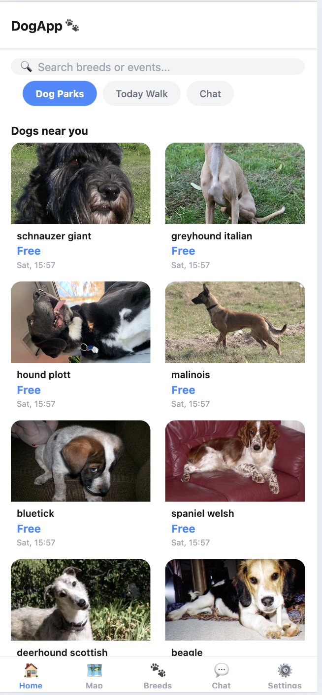
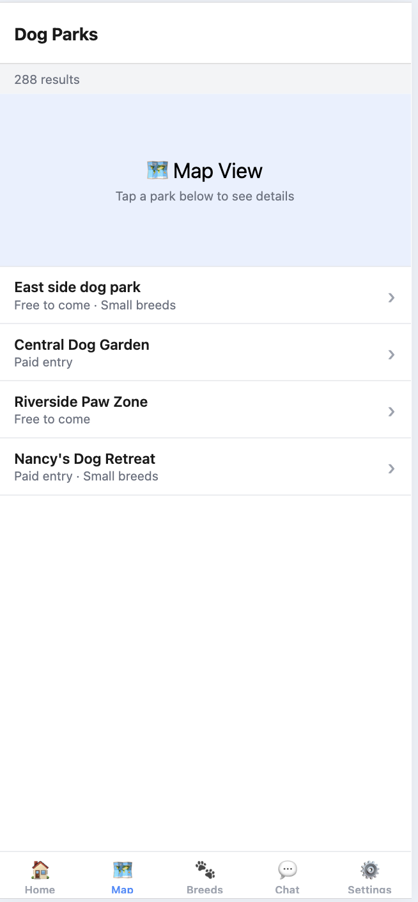
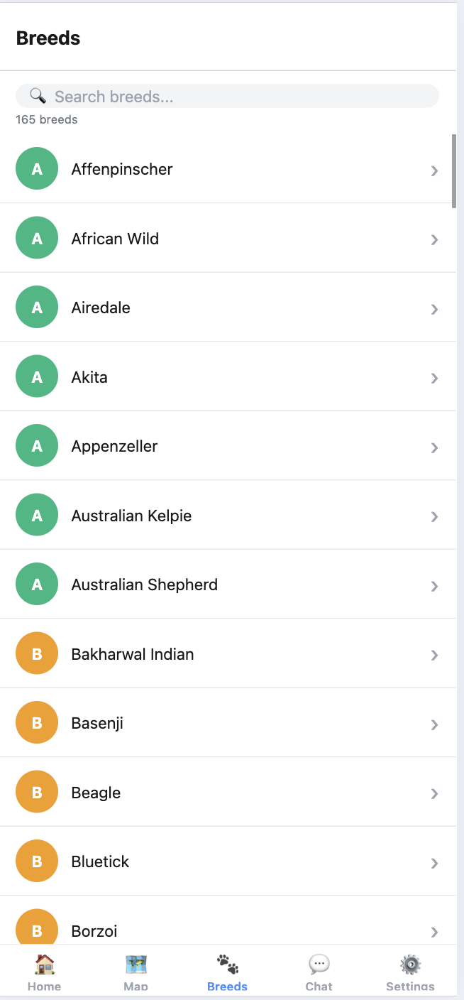
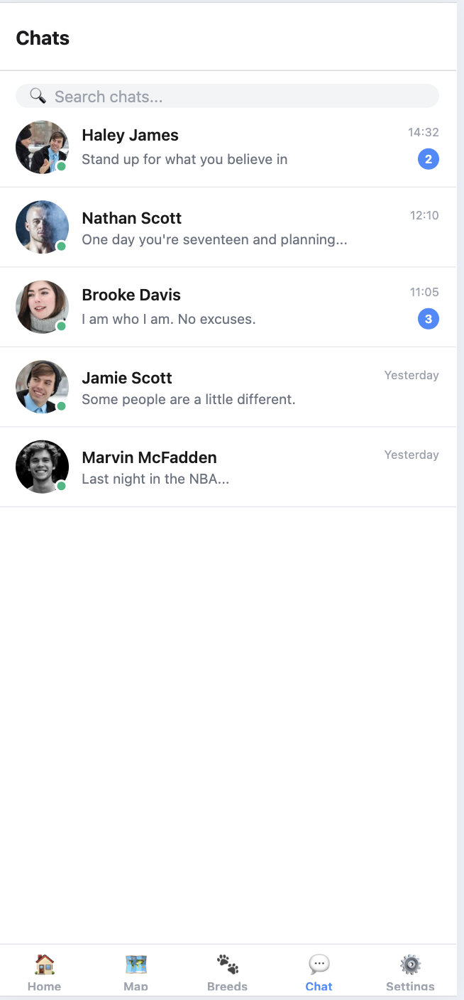

https://github.com/user-attachments/assets/89b1613b-4df1-495e-85cf-d922fe13d313


https://github.com/user-attachments/assets/98849fc9-6208-4fb7-8a92-8e2814a5aeed


# DogApp

## Screenshots

| Home | Map | Breeds | Chat |
|------|-----|--------|------|
|  |  |  |  |

React Native mobile app built with Expo. Browse dog breeds, explore photo galleries, save favorites, and chat — with light/dark theme support and user profile management.

## Features

| Feature | Details |
|---|---|
| Dog feed | Random breed photos fetched from Dog CEO API |
| Activity details | Full-screen view with breed gallery and favorites |
| Breed Explorer | Browse all breeds with search filter and photo gallery |
| Interactive map | Dog park markers with detail screen |
| Chat | Searchable conversation list |
| Favorites | Redux-powered list with add/remove/clear |
| Dark mode | ThemeContext toggle, persists across screens |
| User profile | Owner name, dog name and breed — editable in Settings |
| Auth flow | Login → SignUp → Confirm Code (mock) |

## Tech Stack

- **React Native** + **Expo SDK 54**
- **React Navigation v7** — Stack, Tab, Drawer navigators
- **React Redux** (Redux Toolkit) — favorites state
- **Context API** — AuthContext, ThemeContext, UserContext
- **react-native-reanimated v4** — press-scale animations
- **Dog CEO API** — `https://dog.ceo/api` (free, no auth)
- **dayjs** — date formatting (2 kB vs moment's 72 kB)

## Navigation Structure

```
NavigationContainer
└── AuthStack (unauthenticated)
│   ├── Login
│   ├── SignUp
│   └── ConfirmCode
└── DrawerNavigator (authenticated)
    ├── MainTabs
    │   ├── MainStack
    │   │   ├── Main (feed)
    │   │   └── ActivityDetails
    │   ├── MapStack
    │   │   ├── Map
    │   │   └── ParkDetails
    │   ├── BreedStack
    │   │   ├── BreedExplorer
    │   │   └── BreedGallery
    │   ├── Chat
    │   └── Settings
    └── Favorites
```

## State Management

| State | Tool | Why |
|---|---|---|
| Auth (login/logout) | AuthContext | Simple boolean, no persistence needed |
| Theme (light/dark) | ThemeContext | Global UI state, no async |
| User profile | UserContext | Local profile, scoped to app session |
| Favorites list | Redux Toolkit | Complex actions (add/remove/clear), selector reuse across screens |

## Assignments

### DZ 5 — Navigation
- Stack navigator: Main → ActivityDetails (params: title, image, breed)
- Bottom tab navigator: Home, Map, Chat, Settings with emoji icons
- Drawer navigator: wraps tabs, adds Favorites shortcut with item count badge
- All screen names in `src/constants/screens.js`

### DZ 6 — API Integration
- `src/api/api.js` — all fetch logic isolated
- `fetchDogFeed()` — 10 random images, mapped to ActivityCard shape
- `fetchBreedImages(breedFolder)` — gallery images for a specific breed
- FlatList with ActivityIndicator and error banner

### DZ (State Management)
- **ThemeContext**: `isDark`, `toggleTheme`, `colors` object — all screens consume via `useTheme()`
- **Redux**: `favoritesSlice` with `addFavorite` (dedup by id), `removeFavorite`, `clearFavorites`
- Heart button in ActivityDetails, count badge in DrawerContent

### DZ (Performance)
- `useSharedValue` + `withSpring` press animation on ActivityCard
- `React.memo` on ActivityCard, ChatListItem, BreedCard
- `useMemo` for filtered lists in MainScreen, ChatScreen, BreedExplorerScreen
- `useCallback` for navigation handlers
- `dayjs` replaces any heavy date library

### DZ 7 — Extended Functionality
- **Breed Explorer tab** — fetches full breed list, filter by name, navigates to gallery grid
- **BreedGallery** — 3-column photo grid, 18 images per breed
- **UserContext** — owner name, dog name, dog breed stored in context
- **Settings profile** — tap avatar to open bottom-sheet modal and edit profile fields

## Project Structure

```
dog-app/
├── App.js
├── src/
│   ├── api/
│   │   └── api.js
│   ├── components/
│   │   ├── ActivityCard.jsx
│   │   ├── BreedCard.jsx
│   │   ├── ChatListItem.jsx
│   │   ├── CustomButton.jsx
│   │   └── InputField.jsx
│   ├── constants/
│   │   ├── colors.js
│   │   └── screens.js
│   ├── context/
│   │   ├── AuthContext.js
│   │   ├── ThemeContext.js
│   │   └── UserContext.js
│   ├── navigation/
│   │   ├── AuthStack.jsx
│   │   ├── BreedStack.jsx
│   │   ├── DrawerNavigator.jsx
│   │   ├── MainStack.jsx
│   │   ├── MainTabs.jsx
│   │   └── MapStack.jsx
│   ├── redux/
│   │   ├── favoritesSlice.js
│   │   └── store.js
│   └── screens/
│       ├── ActivityDetailsScreen.jsx
│       ├── BreedExplorerScreen.jsx
│       ├── BreedGalleryScreen.jsx
│       ├── ChatScreen.jsx
│       ├── DrawerContent.jsx
│       ├── FavoritesScreen.jsx
│       ├── LoginScreen.jsx
│       ├── MainScreen.jsx
│       ├── MapScreen.jsx
│       ├── ParkDetailsScreen.jsx
│       ├── SettingsScreen.jsx
│       └── SignUpScreen.jsx
└── package.json
```
